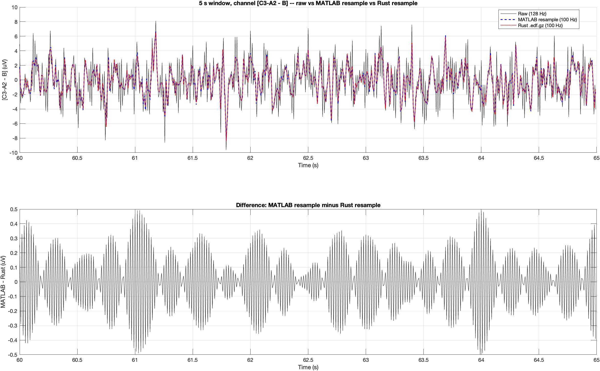

# EDF_toolbox

High-performance EDF / EDF+ reader **and writer** for MATLAB, with compiled MEX backends and pure-MATLAB fallbacks. Reads and writes plain `.edf`, gzip-compressed `.edf.gz`, and zstd-compressed `.edf.zst` (on the fly, no temp file). Bundled with `convert_EDF` (read → resample → write) and `batch_convert_EDF` (parallel multi-file pipeline), plus a `bin/convert_edf` shell CLI.

Handles the things that break off-the-shelf EDF readers in practice: malformed record counts in clinical files, EDF+ TAL annotations, A-B rereferencing at load time, de-identification, compressed archives, anti-aliased resampling, and large polysomnography recordings where a naive loop is slow.

Part of the Prerau Lab [`preraulab_utilities`](https://github.com/preraulab/preraulab_utilities) meta-repository. Can also be used standalone.

## Quick start

```matlab
% Read (.edf / .edf.gz / .edf.zst all work)
[header, signal_header, signal_cell, annotations] = read_EDF('sleep.edf');

% Write — output extension picks the format
write_EDF('sleep_copy.edf.gz',  header, signal_header, signal_cell, annotations);
write_EDF('sleep_copy.edf.zst', header, signal_header, signal_cell, annotations);

% Read → resample to 128 Hz → write (zstd-compressed, anti-aliased)
convert_EDF('sleep.edf', 128);
% writes sleep_128Hz.edf.zst next to the input

% Batch a directory of EDFs, parallel
result = batch_convert_EDF('/path/to/edfs', 128, 'OutputDir', '/path/out');
```

From the shell (calls MATLAB):

```sh
bin/convert_edf -r 128 -o /path/out /path/to/edfs                # zstd-9 by default
bin/convert_edf -r 128 --compress-mode gzip --gzip-level 9 /path/to/edfs
```

For one-shot batch conversion of many files, the **standalone Rust binary** is ~3× faster and has no MATLAB dependency:

```sh
cd rust && cargo build --release
./target/release/convert_edf -F 100 --out /path/out /path/to/edfs
# default output: .edf.gz (gzip-9, parallel, all cores)
```

- `header` — struct with main-header metadata (patient ID, record duration, start date/time, etc.)
- `signal_header` — struct array, one per channel (label, transducer, physical range, sample rate)
- `signal_cell` — cell array of channel vectors in physical units (scaled from digital)
- `annotations` — struct array of EDF+ events (onset, text)

## Features

| Feature | What it does |
|---|---|
| **Full header parsing** | 256-byte main header + 16-field-per-signal header per EDF spec |
| **MEX acceleration** | Compiled C reader; pure MATLAB fallback if MEX isn't available or is disabled |
| **Compressed input/output** | Reads and writes `.edf.gz` (zlib) and `.edf.zst` (libzstd) directly — no temp file, streaming on the fly. zstd is ~5× faster to compress than gzip-6 with smaller output and is the recommended format. |
| **Channel subsetting** | Load only specific channels by name |
| **Re-referencing on load** | `'C3-A2'` (legacy A-B), `'C3 - mean(A1,A2)'` (linked-mastoid style), `'LM = mean(A1,A2)'` named references with `'C3-LM'`, aliased outputs `'OUT = expr'`, `+`/`-` sums, `mean(...)` of N constituents |
| **Epoch subsetting** | Load only a `[start_epoch end_epoch]` slice |
| **EDF+ annotations** | Parse TAL (Time-Annotation List) format |
| **Header repair** | Correct invalid `num_data_records` and save a `_fixed` copy (plain `.edf` only) |
| **De-identification** | Strip PHI fields and save a `_deidentified` copy (plain `.edf` only) |
| **Digital → physical scaling** | `phys_val = phys_min + (dig_val - dig_min) × (phys_max - phys_min) / (dig_max - dig_min)` — done correctly per-channel |
| **Streaming I/O** | Reads and writes record-by-record; peak memory is ~one record + the output arrays, even for multi-GB files |
| **Write side** | `write_EDF` mirrors `read_EDF`; same struct shapes round-trip through `read → write → read` to within ~1 digital LSB |
| **Resample pipeline** | `convert_EDF` reads, resamples every channel to a target rate (anti-aliased Kaiser FIR via SPT `resample`), and writes — defaults to `.edf.zst` output |
| **Parallel batch** | `batch_convert_EDF` runs `convert_EDF` over a list/dir/cell of files via `parfor`; per-file errors don't abort the batch |
| **Shell CLI** | `bin/convert_edf` — POSIX shell wrapper, single `matlab -batch` invocation per call |

## Usage

### Basic

```matlab
% Load all channels
[header, sig_hdr, signals, annot] = read_EDF('psg.edf');

% Load specific channels (names are matched case-insensitively)
[~, ~, signals] = read_EDF('psg.edf', 'Channels', {'EEG C3-A2', 'EEG O2-A1', 'EOG Left-Right'});
```

### Re-referencing on load

`read_EDF` accepts a small expression syntax inside `'Channels'` so you can derive new signals without round-tripping through MATLAB. Three operators: `+`, `-`, and `mean(...)`. An optional alias prefix `'OUT = expr'` sets the output channel's label.

#### Legacy A-B form

```matlab
[~, ~, s] = read_EDF('psg.edf', 'Channels', {'C3-A2'});
```

Loads both `C3` and `A2`, subtracts, returns a single re-referenced signal labeled `'C3-A2'`.

#### Inline `mean(...)` — linked mastoid

For a recording where every channel is referenced to a single electrode (e.g., `Fpz`), and the EDF labels are `C3`, `C4`, `A1`, `A2`, you can build linked-mastoid derivations directly:

```matlab
[~, sh, sc] = read_EDF('psg.edf', 'Channels', { ...
    'C3_LM  = C3 - mean(A1, A2)', ...
    'C4_LM  = C4 - mean(A1, A2)', ...
    'Fpz_LM =    -mean(A1, A2)' ...
});
```

Each spec is parsed as a flat coefficient/leaf linear combination — `mean(A1, A2)` distributes `1/N` across each constituent.

#### Named references — `'References'`

If the same constituent list shows up in multiple specs, define it once via the `'References'` argument:

```matlab
[~, sh, sc] = read_EDF('psg.edf', ...
    'References', {'LM = mean(A1, A2)'}, ...
    'Channels',   {'C3-LM', 'C4-LM', '-LM'});
```

References are evaluated in declared order, so a reference can build on an earlier reference. Each reference becomes a name in the channel namespace; bare-reference output (`'Channels', {'LM'}`) returns the mean signal itself.

A `'NAME = expr'` reference is **required** to use the alias form (the whole point is to bind a name); inside `'Channels'`, the alias is optional.

#### Chaining inside `'Channels'`

Aliased outputs become reusable names for any *later* `'Channels'` entry, so a multi-step derivation can be expressed inline without `'References'`:

```matlab
[~, sh, sc] = read_EDF('psg.edf', 'Channels', { ...
    'LM       = mean(A1, A2)', ...
    'C3_LM    = C3 - LM', ...
    'NewChan  = C3_LM + 0.5'   % uses both the previous outputs
});
```

The difference vs `'References'`: aliased Channels entries are *returned* as outputs; `'References'` outputs are hidden helpers (drop out of the returned cell unless asked for explicitly). Use `'References'` for intermediates the caller doesn't want to see; use chained `'Channels'` when every step is part of the result. Unaliased entries (`'C3 - A2'` with no `=`) are one-shot — they don't pollute the namespace for later specs.

#### Resolution: how a spec becomes a signal

Every `'Channels'` and `'References'` spec is **preprocessed** before parsing: a single greedy longest-match pass walks the augmented label set (real EDF labels + earlier References + earlier aliased outputs) and wraps each occurrence in `$...$` tokens. The parser then sees only `$LABEL$` tokens, operators (`+`, `-`, `,`, `(`, `)`, `=`), and `mean`. There is no longest-prefix matching inside the parser.

```text
EDF labels: {'EEG C3 - A2', 'EEG C3', 'A2', 'EMG'}

'EEG C3 - A2'         ->  '$EEG C3 - A2$'          (passthrough; longest match wraps the whole spec)
'EEG C3 - A2 - A2'    ->  '$EEG C3 - A2$ - $A2$'   ((labeled C3-A2) − A2; longest-first then leftover)
'mean(EEG C3, A2)'    ->  'mean($EEG C3$, $A2$)'   (inline mean of two leaves)
'OUT = EEG C3 - A2'   ->  'OUT = $EEG C3 - A2$'    (aliased passthrough; alias name is left alone)
```

Pass `'Verbose', true` to see exactly how each spec was wrapped — useful when you suspect a label-vs-expression collision:

```matlab
read_EDF('psg.edf', 'Channels', {'EEG C3 - A2 - A2'}, 'Verbose', true);
% read_EDF: 'EEG C3 - A2 - A2'  ->  '$EEG C3 - A2$ - $A2$'
```

#### Forcing a computed expression when the whole string is a label

If you want a *computed* difference and the EDF happens to contain a labeled channel matching the same string, write each leaf with explicit `$...$` — user-supplied `$...$` regions are left untouched by the preprocessor:

```matlab
[~, ~, s_labeled]  = read_EDF('psg.edf', 'Channels', {'EEG C3 - A2'});       % the labeled channel
[~, ~, s_computed] = read_EDF('psg.edf', 'Channels', {'$EEG C3$ - $A2$'});   % computed difference
```

Use `$label$` whenever you want to override the longest-match interpretation, or whenever a label contains characters the parser would otherwise eat (`+`, `,`, `(`, `)`, `=`, or labels starting with `mean`).

#### Constraints

- All leaves of a single spec or reference must share the same sampling rate. Mismatch errors with `read_EDF:RateMismatch`.
- Reference names cannot collide with EDF labels or with each other (case-insensitive). Collision errors with `read_EDF:RefCollision`.
- `mean(...)` requires at least 2 arguments; a single-channel mean errors with `read_EDF:BadMean`.
- Synthetic reference signals are dropped from the returned cell unless explicitly requested in `'Channels'`.

### Load a specific time window

```matlab
% Load epochs 30 to 60 (0-indexed, in units of the EDF record duration)
[~, ~, signals] = read_EDF('psg.edf', 'Epochs', [30 60]);
```

### Read a compressed EDF

Pass an `.edf.gz` or `.edf.zst` path. The reader streams through zlib / libzstd — no temp file is written.

```matlab
[header, sig_hdr, signals, annot] = read_EDF('psg.edf.gz');
[header, sig_hdr, signals, annot] = read_EDF('psg.edf.zst');
```

`RepairHeader` and `deidentify` cannot modify a compressed archive in place; they're disabled (with a warning) for both `.gz` and `.zst` inputs. Decompress to `.edf` first if you need either.

### Repair a broken file

Clinical EDFs sometimes have invalid `num_data_records` — the field says one number but the file actually contains a different amount of data. Passing `'RepairHeader', true` recomputes the correct value and writes it to a `<filename>_fixed.edf` file:

```matlab
[~, ~, ~] = read_EDF('broken.edf', 'RepairHeader', true);
% Writes broken_fixed.edf
```

### De-identify

```matlab
[~, ~, ~] = read_EDF('patient.edf', 'deidentify', true);
% Writes patient_deidentified.edf with PHI fields blanked
```

### Force pure-MATLAB path (disable MEX)

```matlab
[~, ~, s] = read_EDF('f.edf', 'forceMATLAB', true);
```

### Write an EDF

```matlab
% Round-trip
[h, sh, sc, ann] = read_EDF('in.edf');
write_EDF('out.edf', h, sh, sc, ann);

% Compressed output — choose the format by the file extension
write_EDF('out.edf.gz',  h, sh, sc, ann);                       % gzip, level 6
write_EDF('out.edf.gz',  h, sh, sc, ann, 'GzipLevel', 1);       % gzip, faster
write_EDF('out.edf.zst', h, sh, sc, ann);                       % zstd, level 3
write_EDF('out.edf.zst', h, sh, sc, ann, 'ZstdLevel', 9);       % zstd, smaller

% AutoScale: 'preserve' (default for write_EDF) keeps physical_min/max and
%            clips data to fit;
%            'recompute' sets physical_min/max from the data (no clipping).
write_EDF('out.edf', h, sh, sc, [], 'AutoScale', 'recompute');

% Channels / References — same expression syntax as read_EDF. Selects
% (and/or computes) which channels reach the output. AutoScale='recompute'
% is a good default here because the derived signals' range can extend
% beyond any single constituent's physical_min/max.
write_EDF('out.edf', h, sh, sc, [], ...
    'References', {'LM = mean(A1, A2)'}, ...
    'Channels',   {'C3 - LM', 'C4 - LM'}, ...
    'AutoScale',  'recompute');
```

The default `'preserve'` mode is required for lossless `read → write → read` round-trip; round-tripped signals match the originals to within one digital LSB per channel. Use `'recompute'` whenever the data may exceed the existing `physical_min/max` (e.g. after resampling — see `convert_EDF` below — or after any derivation).

**Compression formats.** zstd is the recommended default: roughly 5× faster to compress than gzip level 6 with similar or better ratios, and decompression is also faster. Use `.edf.gz` only when you need to hand the file to a tool that does not understand `.zst`.

### Resample one EDF (read → resample → write)

```matlab
% Default: writes sleep_128Hz.edf.zst next to the input
convert_EDF('sleep.edf', 128);

% Choose a different compression mode
convert_EDF('sleep.edf', 128, 'CompressMode', 'gzip');           % .edf.gz output
convert_EDF('sleep.edf', 128, 'CompressMode', 'gzip', 'GzipLevel', 1);
convert_EDF('sleep.edf', 128, 'CompressMode', 'zstd', 'ZstdLevel', 9);

% No compression
convert_EDF('sleep.edf', 128, 'OutputName', '/tmp/out.edf', 'CompressMode', 'none');
```

Resampling uses SPT's `resample` (Kaiser-windowed sinc FIR, anti-aliased). The annotation channel is preserved; only signal channels are resampled. `target_rate * data_record_duration` must be an integer (the writer needs an integer `samples_in_record`); the function errors with the closest valid alternative if not.

`convert_EDF` defaults `'AutoScale'` to `'recompute'` (vs `write_EDF`'s `'preserve'` default). The anti-aliasing filter can briefly produce samples outside the source file's stored `physical_min/max`; `recompute` widens the range to the actual resampled data so those samples are not clipped on encode.

### Batch many EDFs

```matlab
% Cell array of explicit paths
result = batch_convert_EDF({'a.edf', 'b.edf'}, 128, ...
    'OutputDir', '/path/out', 'Parallel', true);

% Whole directory
result = batch_convert_EDF('/path/in', 128, 'Pattern', '*.edf');

% Text file with one path per line (.txt or .list)
result = batch_convert_EDF('list.txt', 128);
```

`result` is a table with columns `input`, `output`, `status` (`'ok'`/`'failed'`), `elapsed_s`, `error_message`. Per-file failures don't abort the batch.

**Compress a folder of EDFs** — the most common batch use: resample every `.edf` (and `.edf.gz` / `.edf.zst`) in a directory to a uniform target rate and write zstd-compressed copies to an output folder. Runs in parallel across files when a parpool is available.

```matlab
% Default: zstd compression, AutoScale='recompute', parfor across files
result = batch_convert_EDF('/data/edfs_in', 100, ...
    'OutputDir', '/data/edfs_out');

% Pick gzip-1 instead of zstd (e.g. for compatibility with tools that only read .gz)
result = batch_convert_EDF('/data/edfs_in', 100, ...
    'OutputDir',    '/data/edfs_out', ...
    'CompressMode', 'gzip', ...
    'GzipLevel',    1);

% Inspect what happened
nok = sum(strcmp(result.status, 'ok'));
fprintf('%d / %d files converted, total elapsed %.1f s\n', ...
        nok, height(result), sum(result.elapsed_s));
disp(result(strcmp(result.status, 'failed'), {'input', 'error_message'}));
```

**Parallelism note — `WorkerThreads`.** `batch_convert_EDF` runs `parfor` across files and pins each parpool worker to **1 BLAS thread** by default (`'WorkerThreads', 1`). Without this pin, every worker's internal BLAS pool tries to use every core, and `N_workers × N_cores` threads competing for `N_cores` makes `resample` run *several × slower than serial*. The default works correctly for almost every case; only override if you know your workload is not BLAS-heavy and you have spare cores.

```matlab
% Almost always correct: rely on the default WorkerThreads=1
result = batch_convert_EDF('/data/edfs_in', 100, 'OutputDir', '/data/out');

% Explicit if you know your workload is not BLAS-heavy:
result = batch_convert_EDF('/data/edfs_in', 100, ...
    'OutputDir', '/data/out', 'WorkerThreads', 2);
```

**Staging on NFS / shared storage.** When inputs and outputs live on a shared network filesystem (NFS, Lustre, etc.), running multiple `parfor` workers against the same mount can *slow things down* because the workers contend at the file server. Pass `'StageLocal', true` to copy each input to a local scratch directory first, run the conversion locally, then move the output back. Disk space required per worker is roughly one input file at a time. Note: the staging dir itself must be on real local storage — if the system tempdir is also NFS-mounted (some HPC setups), point `'StageDir'` at a known-local path like `/dev/shm` or `/scratch/$USER`.

```matlab
% Stage to system tempdir (default) — fixes NFS contention almost always
result = batch_convert_EDF('/data/nfs/edfs', 100, ...
    'OutputDir',  '/data/nfs/out', ...
    'StageLocal', true);

% Pin to a specific local scratch location (e.g. fast NVMe)
result = batch_convert_EDF('/data/nfs/edfs', 100, ...
    'OutputDir',  '/data/nfs/out', ...
    'StageLocal', true, ...
    'StageDir',   '/scratch/local');
```

### Shell CLI

`bin/convert_edf` is a POSIX shell wrapper for `batch_convert_EDF`. It auto-detects `matlab` on `$PATH` (or in standard install locations on macOS/Linux), invokes a single `matlab -batch`, and exits non-zero if any file failed.

```sh
bin/convert_edf --help

# Single file (zstd by default)
bin/convert_edf -r 128 sleep.edf

# A whole directory, custom output dir
bin/convert_edf -r 128 -o /path/out /path/in

# Switch to gzip output, level 1 (fastest gzip)
bin/convert_edf -r 128 --compress-mode gzip --gzip-level 1 /path/in

# Inputs live on NFS — stage to local scratch to avoid worker contention
bin/convert_edf -r 128 -o /data/nfs/out --stage-local /data/nfs/in
bin/convert_edf -r 128 -o /data/nfs/out --stage-dir /scratch /data/nfs/in

# Disable compression and parfor; run quietly
bin/convert_edf -r 128 --compress-mode none --no-parallel /path/file.edf
```

The CLI shells out to MATLAB once per invocation — startup cost (~10 s) is amortized across the whole batch, which is why a single `convert_edf` call across many files is much faster than scripting per-file invocations.

### Rust binary — fastest path for big batches

For one-shot conversion of hundreds–thousands of files, the standalone Rust binary at `rust/` is **~3× faster** than the MATLAB pipeline and has no MATLAB dependency. It uses `rubato`'s FFT resampler, parallel-gzip via `gzp`, and per-file `rayon` parallelism.

```sh
cd rust
cargo build --release
# binary at rust/target/release/convert_edf
# (on macOS with MacPorts: prepend AR=/usr/bin/ar RANLIB=/usr/bin/ranlib)
```

**Put it on `$PATH`** so you can call `convert_edf` from any directory instead of `./target/release/convert_edf`:

```sh
# Option A — cargo install (recommended; installs to ~/.cargo/bin which is
# already on $PATH for any user with a working Rust toolchain)
cd rust && cargo install --path .

# Option B — symlink the build output into a dir already on your $PATH
ln -s "$(pwd)/rust/target/release/convert_edf" ~/.local/bin/convert_edf

# Option C — extend $PATH in your shell rc
echo 'export PATH="$HOME/EDF_toolbox/rust/target/release:$PATH"' >> ~/.bashrc
```

Once installed, drop the `./` prefix from every example below — `convert_edf -F 100 -R /data` works from anywhere.

**Verifying the installed version.** `--version` reports the Cargo version plus the git SHA and date the binary was built from, e.g.

```sh
$ convert_edf --version
convert_edf_rs 0.1.0 (d869c4d44b 2026-05-03)
```

Compare against `git ls-remote` to check whether the binary on a given cluster node is current:

```sh
INSTALLED=$(convert_edf --version | awk '{print $3}' | tr -d '(')
REMOTE=$(git ls-remote git@github.com:preraulab/EDF_toolbox.git master | cut -c1-10)
[ "$INSTALLED" = "$REMOTE" ] && echo "up to date" || echo "out of date — pull and cargo install --path . again"
```

A trailing `-dirty` on the SHA means the binary was built from a working tree with uncommitted changes — likely a developer build, not a clean tagged version.

Defaults — `--compress gzip --gzip-level 9`, `--auto-scale recompute`, `--jobs 0` (= `min(num_cpus, 8)`) — are tuned for typical PSG batches. The CLI takes one or more positional inputs that may be files or directories, mixed:

```sh
# A single file
./convert_edf -F 100 -o output.edf.gz input.edf

# A whole directory (top-level only)
./convert_edf -F 100 --out /data/edfs_out /data/edfs_in

# A directory tree, recursively (mirrors source structure under --out)
./convert_edf -F 100 --out /data/edfs_out -R /data/study_root

# Several specific files
./convert_edf -F 100 --out /data/edfs_out a.edf b.edf c.edf

# Mix of files and directories in one shot
./convert_edf -F 100 --out /data/edfs_out -R one.edf /data/edfs_in /data/more
```

Recursive output is mirrored into `--out` by default — e.g. `/in/sub/foo.edf` becomes `/out/sub/foo_100Hz.edf.gz`. Pass `--flatten` to drop everything at the top of `--out`:

```sh
./convert_edf -F 100 --out /flat -R --flatten /data/study_root
```

**In-situ (in-place) writes.** Omit `--out` to write each output next to its input, leaving the source tree's structure intact. This is the right mode for compressing a complicated study tree without setting up a parallel output directory:

```sh
# For each foo.edf anywhere under /data/study_root, write
# foo_100Hz.edf.gz right beside it; original .edf is left untouched.
./convert_edf -F 100 -R /data/study_root
```

Re-running in-situ at the same rate is idempotent: the directory walk skips files matching the output naming pattern (`*_<rate>Hz.edf*`) so you do not get `_100Hz_100Hz.edf.gz` artifacts. Re-running at a *different* rate (e.g. -F 50) does pick up those earlier outputs as legitimate inputs and produces a new set alongside.

Codec, parallelism, and verbosity work the same regardless of input shape:

```sh
# Force zstd output (faster decode, slightly bigger than gzip-9, slower to write)
./convert_edf -F 100 --out /out --compress zstd --zstd-level 3 -R /in

# Pure resample, no compression (fastest write, biggest output)
./convert_edf -F 100 --out /out --compress none /in

# Maximum compression for write-once archives (much slower, ~10 % smaller)
./convert_edf -F 100 --out /out --compress zstd --zstd-level 19 -R /in

# Limit parallelism (e.g. on a shared box)
./convert_edf -F 100 --out /out --jobs 8 /in

# Verbose progress
./convert_edf -F 100 --out /out -v /in
```

**Existing-output handling.** By default, if the intended output file already exists the input is skipped with a one-line warning — safe behavior for shared NFS data dirs. Three mutually-exclusive overrides (cp idiom):

```sh
# -i : prompt per-collision: [y]es / [n]o / [A]ll / [N]one
./convert_edf -F 100 -R -i /data/study_root

# -f : force overwrite of every existing output
./convert_edf -F 100 -R -f /data/study_root

# -n : silent skip (no warning), explicit form of the default
./convert_edf -F 100 -R -n /data/study_root
```

If `-i` is used without a tty (piped, batch job, etc.) it falls back to skip-and-warn. Once the user picks `A` or `N` at any prompt, that decision sticks for the rest of the run.

**Atomic writes.** All output is written to `<name>.partial` and atomically renamed to the final path on success. A Ctrl-C / SIGKILL / power-loss mid-write leaves only the `.partial` sibling — the final filename either does not exist or still holds the previous good copy. A subsequent re-run overwrites the orphan `.partial` and produces a fresh output. This means an existing final file is *always* a complete file (passes `gunzip -t` / `zstd -t`); you only need to worry about a partially-written file if you see a leftover `*.partial` in the tree.

**Parallelism: `--jobs` and `--codec-threads`.** `--jobs` controls how many files are converted concurrently. The default (`--jobs 0`) is **`min(num_cpus, 8)`** — capped because each rayon worker holds an entire decoded PSG in RAM (often 1–3 GB as f32 physical units), so on a 64-core box uncapped concurrency would OOM-kill the process long before saturating CPU. Spare cores are not wasted: each in-flight worker also runs the codec (parallel-gzip via `gzp`, or zstd-mt) in its own thread pool, and the binary auto-divides leftover cores into per-worker codec threads. Total active threads stay near `nproc`.

Override `--jobs` upward if you know the files are small or the machine has plenty of RAM; downward (`--jobs 4`, `--jobs 2`) for very large PSGs on tight-memory boxes. Override `--codec-threads N` if you have a specific reason. `-v` prints the chosen budget at startup, e.g. `thread budget: 64 cores / 8 rayon workers => 8 codec threads each`.

**Deleting source EDFs.** Two flags control whether originals are removed after their compressed sibling is written. They are orthogonal: `--delete-source` chooses the *policy*, `--cleanup-only` chooses the *timing*.

`--delete-source <MODE>` modes:

| Mode | Verify? | Prompt? | Behavior |
|---|---|---|---|
| `never` (default) | n/a | n/a | Keep every source. |
| `ask` | yes | yes | Decompress the output end-to-end; if clean, prompt `[y]es / [n]o / [A]ll / [N]one` per source. Falls back to skip-and-warn without a tty. |
| `silent` | yes | no | Verify, then delete silently. |
| `force` | no | no | Skip the verify; delete immediately after the rename. Fastest, useful for trusted pipelines. |

`--cleanup-only` skips the conversion step entirely; for each input, if its expected output (`<stem>_<rate>Hz.edf.{gz,zst}`) is already on disk, the `--delete-source` policy is applied to the source. Useful for finishing disk cleanup after an earlier run completed without `--delete-source`.

```sh
# Compress + delete-as-you-go (most common — verify each output, no prompt):
convert_edf -F 100 -R --delete-source silent /data

# Compress + per-file confirm:
convert_edf -F 100 -R --delete-source ask /data

# Just sweep delete now — outputs already exist from a previous run:
convert_edf -F 100 -R --cleanup-only --delete-source silent /data
```

Verification is in-process (`flate2` for gzip, `zstd` crate for zstd) — no shelling out to `gunzip -t` / `zstd -t` — so a failed integrity check on the output reliably blocks the matching source from being deleted in any mode except `force`.

Notes:
- Output paths and extensions: `-o FILE` (single-file mode) always wins regardless of `--compress`. In multi-file mode `-o` must be a directory; omit it to write in-situ next to each input. The codec flag drives the extension on every output.
- Hidden files and directories (names starting with `.`) are skipped — no surprise pickups of `.DS_Store`, `.git`, etc.
- Files matching the output naming pattern (`*_<rate>Hz.edf*`) are skipped during directory walks at the *same* rate, so re-runs are idempotent. Explicit positional file arguments are always honored even if their names match this pattern.

The Rust binary defaults to gzip-9 while MATLAB defaults to zstd-9 because MATLAB's gzip path is single-threaded; the parallel-gzip win in `gzp` does not transfer there. On a 24-core box the Rust pipeline finishes a 10-file batch in ~11 s vs ~38 s for MATLAB.

#### Resampler caveat — Rust FFT FIR vs MATLAB Kaiser sinc

The Rust pipeline uses `rubato`'s `FftFixedIn` (FFT-domain anti-alias multiply); the MATLAB pipeline uses SPT's `resample` (Kaiser-windowed sinc FIR, β≈5). Both are linear-phase / zero-phase (Rust's group delay is compensated internally) and both anti-alias correctly into the target Nyquist band, but their stopband shape near Nyquist is not identical.

For a 40160 s clinical PSG resampled 128 → 100 Hz, MATLAB-resampled vs Rust-resampled samples agree to:

- **Lag**: 0 samples (zero-phase, time-aligned)
- **RMS difference**: ~3.7 % of signal RMS over the full record
- **Per-sample**: typically <0.5 µV against a ~30 µV-RMS EEG signal



*5 s window of channel C3-A2: raw (black, 128 Hz), MATLAB resample (blue dashed, 100 Hz), Rust resample (red dotted, 100 Hz). Bottom panel is MATLAB − Rust, bounded at ±0.5 µV — the residual is high-frequency energy near Nyquist where the two filters' transition bands disagree slightly. No DC offset, no time skew.*

What this means in practice:

- **Sleep / EEG analysis (delta, theta, alpha, sigma/spindle, beta, low gamma — anything ≤30 Hz)**: indistinguishable. Use either.
- **High-gamma analysis (60–90 Hz on a 200+ Hz target rate) or sharp-spike morphology**: the last few Hz before Nyquist may differ by O(1 µV). If you need bit-exact MATLAB-resample output, use the MATLAB pipeline.
- **Round-trip / archival**: the two outputs are not byte-identical. They are scientifically equivalent within the band of interest for sleep work, but downstream analyses that hash or diff signal arrays will not match across the two pipelines.

### Inspect the header in a GUI

```matlab
[header, sig_hdr] = read_EDF('f.edf');
[ht, st] = header_gui(header, sig_hdr);
% Opens a UIFIGURE with two tables — main header + per-signal headers
```

## Name-value pairs

| Name | Type | Default | Description |
|---|---|---|---|
| `Channels` | cell array of char | `{}` (all) | Which channels to load; supports A-B rereferencing syntax |
| `Epochs` | 1x2 double | `[]` (all) | `[start_epoch end_epoch]`, 0-indexed |
| `Verbose` | logical | `false` | Print progress messages |
| `RepairHeader` | logical | `false` | Fix invalid `num_data_records`, write `_fixed.edf` |
| `forceMATLAB` | logical | `false` | Disable MEX, use pure MATLAB reader |
| `debug` | logical | `false` | Verbose MEX diagnostics |
| `deidentify` | logical | `false` | Blank PHI fields, write `_deidentified.edf` |

## Files

| File | Role |
|---|---|
| `read_EDF.m` | Read entry point — dispatches to MEX or pure-MATLAB, handles rereferencing, annotations, gz decompression |
| `read_EDF_mex.c` | C source for the read MEX accelerator |
| `read_EDF_mex.mexmaca64` | Pre-built read MEX for Apple Silicon |
| `write_EDF.m` | Write entry point — mirror of read_EDF (gz-aware, MEX + MATLAB fallback) |
| `write_EDF_mex.c` | C source for the write MEX accelerator |
| `write_EDF_mex.mexmaca64` | Pre-built write MEX for Apple Silicon |
| `convert_EDF.m` | Read → resample → write helper (one file) |
| `batch_convert_EDF.m` | Multi-file driver with `parfor` and per-file error handling |
| `bin/convert_edf` | POSIX shell wrapper for `batch_convert_EDF` |
| `compile_edf_mex.m` | Shared auto-compile helper (vendored zlib + system libzstd) |
| `zlib/` | Vendored zlib 1.3.2 source (BSD-style license). Compiled into both MEX files so there's no system zlib dependency. |
| `header_gui.m` | Optional UI for inspecting header + signal-header tables |
| `rust/` | Optional standalone Rust port of the read → resample → write pipeline. Roughly 3× faster than the MATLAB pipeline on the same hardware; useful for one-shot batch conversion of large corpora. Build with `cd rust && cargo build --release`. |

If a pre-built MEX isn't available for your platform (Linux, Windows), `read_EDF.m` and `write_EDF.m` will auto-compile on first call. The build pulls in the vendored zlib (no system dep) and links against the system **libzstd** for `.edf.zst` support — the auto-compile script searches `/opt/homebrew` and `/usr/local` for it. To rebuild manually:

```matlab
% From the EDF_toolbox directory
compile_edf_mex(pwd, 'read_EDF_mex.c');
compile_edf_mex(pwd, 'write_EDF_mex.c');
```

## Install

```matlab
addpath('/path/to/EDF_toolbox');
```

When used as part of `preraulab_utilities`, the top-level path setup handles this automatically.

## Dependencies

- **MATLAB R2020a or later**
- **No required toolboxes** for the core `read_EDF.m`
- **libzstd** (only when (re)building the MEX — pre-built `.mexmaca64` files are committed). On macOS: `brew install zstd`. On Debian/Ubuntu: `apt install libzstd-dev`. On RHEL: `dnf install libzstd-devel`.
- `header_gui.m` requires `uifigure` (available in R2016a+ but most polished in R2020a+)
- A C compiler configured for MEX (`mex -setup C`) if you need to rebuild the MEX on a new platform

## Implementation notes

### Why MEX?

EDF files store samples as `int16` and require per-channel digital-to-physical conversion. The naive MATLAB loop is memory-bound and slow on large files. The MEX version:
- Streams records one at a time through a small reusable buffer (peak raw-bytes memory ≈ one record, regardless of file size)
- Decodes int16 → double in tight C loops
- Parses EDF+ annotations in the same pass as the signal data (no second seek-heavy pass)
- Reads/writes `.edf.gz` and `.edf.zst` directly via zlib / libzstd, on the fly with no temp file

Typical speedup for a full-night PSG file: 5-20× over the pure-MATLAB path, depending on channel count.

### gzip vs zstd

The two pipelines have different defaults for a real reason:

- **Rust binary: `gzip-9`.** With the parallel-gzip encoder (`gzp` crate), gzip-9 produces output ~1 % bigger than zstd-9 in roughly half the wall time, on both 24-core Linux and Apple Silicon — pareto-optimal for write speed and size.
- **MATLAB: `zstd-9`.** MATLAB's gzip path shells out to single-threaded system `gzip`, so the parallel-gzip win does not transfer; libzstd's MEX path is multithreaded and ends up faster than single-threaded gzip on multi-core boxes.

Read-side overhead is small for both codecs (tens of ms per file). gzip adds ~80 ms/file, zstd adds ~20 ms/file — a few percent of total read time either way. Pick `--compress zstd --zstd-level 3` if read speed is paramount; pick `--compress zstd --zstd-level 19` for write-once archives where every byte of output matters. All modes produce bit-identical decoded signals.

### Pure-MATLAB fallback

Kicks in when the MEX binary isn't available for your platform and auto-compile fails, or when `'forceMATLAB', true` is passed. Produces bit-identical output; just slower. For `.edf.gz` and `.edf.zst` inputs the MATLAB path decompresses to a temp file first (cleaned up automatically when the call returns) — for `.zst` it shells out to the `zstd` CLI, which must be on `$PATH` for the fallback. Rewriting the MATLAB reader to consume from an in-memory buffer wasn't worth the complexity for the slow path.

## License

BSD 3-Clause. See [`LICENSE`](LICENSE).
